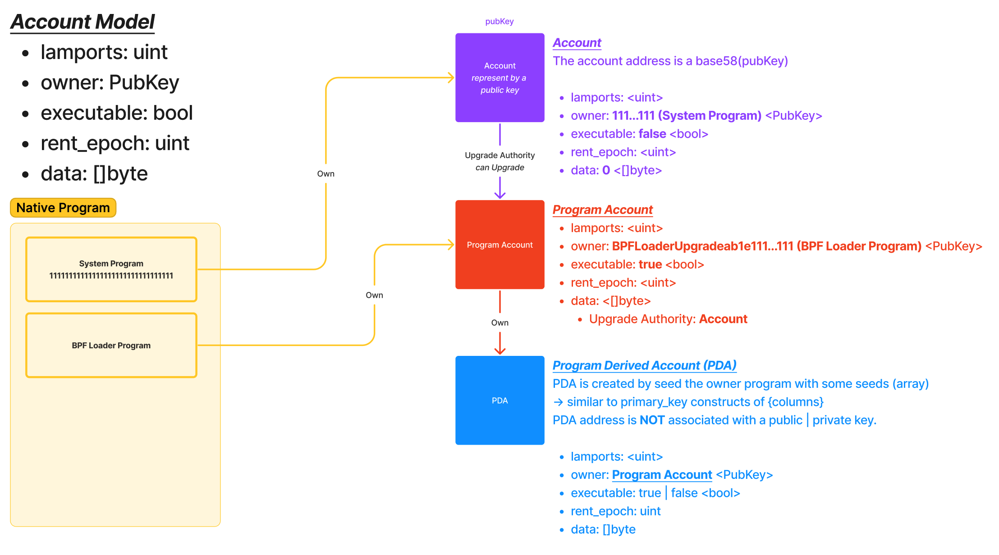

# Intro to Solana Account Model

## The mental model

## There are 4 steps in the program

- Create a KeyPair
  - (?) Use the explorer to see if your public key is existed on-chain yet
- Airdrop SOL to the newly created KeyPair
  - (?) Use the explorer to see if your public key is existed on-chain yet
  - (*) The `FILE` you have just create is a purple one
- Interact with the `PING` program
  - (*) The `PING` program is just a file (red)
- Interact with a `Native Program` to send some SOL.
